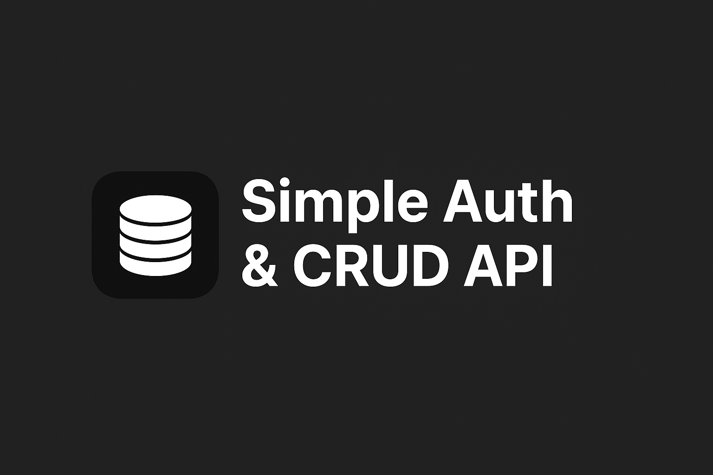

<h1 align="center">
  
  <br>
  Simple Auth & CRUD API
</h1>

<p align="center">
  
</p>

<p align="center">
  A beginner-friendly backend project built with <strong>Node.js</strong>, <strong>Express.js</strong>, and <strong>MongoDB</strong>.
</p>

---

## 📘 Overview

This project serves as an **introductory backend web development task** using:

- **Node.js**
- **Express.js**
- **MongoDB (Mongoose)**

It includes:

- A **simple user authentication system** (register + login)  
- A **CRUD API** for creating, reading, updating, and deleting posts  
- No session or JWT handling — perfect for beginners learning the fundamentals  

This can be used as a small backend for:

- A simple **blog**
- An **inventory management system**
- A **notes or tasks API**
- General backend practice

---

## 🚀 Features

### 🔐 **Authentication**
- Register new users  
- Login existing users  
- Password hashing with Mongoose middleware  
- Basic validation  

### 📝 **Posts CRUD**
- Create a post  
- Retrieve one or all posts  
- Update a post  
- Delete a post  

### 🗄 **Database**
- MongoDB + Mongoose  
- Clean schema structure  
- Automatic timestamps and document shaping

---

## 📂 Project Structure

📦 project
├── 📁 backend
│ ├── 📁 controllers
│ ├── 📁 models
│ ├── 📁 routes
│ └── server.js
├── README.md
└── package.json


---

## 🛠 Tech Stack

- **Node.js**
- **Express.js**
- **MongoDB + Mongoose**
- **Nodemon** (dev)
- **dotenv**

---

## 🔧 Installation & Setup

Clone the repository:
```bash
git clone https://github.com/KitKat-Frankie/into_back_end.git
cd into_back_end
```

## 🔧 Install dependencies
``` bash
npm install
```


``` bash
MONGO_URI=your_mongodb_connection_string
PORT=4000
```

```bash
http
```

## 🎯 Future Improvements

- **Add JWT authentication**
- **Add refresh tokens or sessions**
- **Input validation**
- **Add user roles**
**Swagger documentation**


## 🤝 Contributing

Contributions and suggestions are welcome!
Feel free to open issues or submit pull requests.

## 📄 License

This project is licensed under the MIT License.

## ⭐ Support

If you like the project, give it a star ⭐ on GitHub!